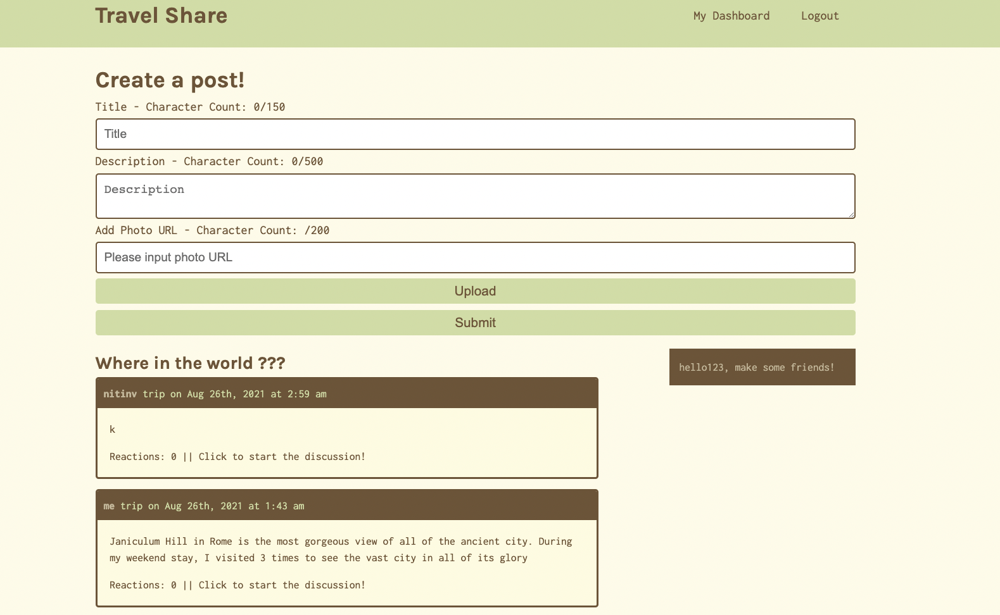

# Travel share 

Have you ever wanted to share a memorable moment from a trip, or have a place to view stories and pictures about trips that friends or family have taken? With Travel Share, you can do just that! Travel share is a no-nonsense app that allows users to give detailed descriptions about trips or vacations that they have gone one, along with allowing them to share pictures of it! You can even add friends on the app, so you can keep track of the awesome trips that your friends go on easily on the feed!

## License

This project is not licensed

## Table of Contents

  * [Description](#description)
  * [Usage/Installation](#usage)
  * [Packages](#packages)
  * [Contributing](#contributing)
  * [Images](#images)
  * [Links](#links)
  
 
 
## Description <a name = "description">

  Travel Share is a React.js application that lets you share stories and pictures of places you have traveled. Whether it's to Disneyland or the Eiffel Tower, you can easily share your amazing trips!.= You can create a signup page that will allow you to post your own travel stories as well as communicate with others about their trips. 

## Usage <a name = "usage">
  How to use
- Download the repo. If you install per server/client, cd to the server/client then npm i or npm install.
- Use npm i or npm install to download packages
- Then start the app by using npm start

## Packages <a name = "packages">
  Packages used

- React
- Apollo Server
- Cloudinary
- react-dom
- react-router-dom
- react-scripts
- graphql 
- jwt-decode
- bcrypt
- mongoose 
- faker
- express
- jsonwebtoken

## Contributing <a name = "contributing"/>

Contributors:

[Nitin Vemuri](www.github.com/nitinvemuri)

[Mike Ebner](https://github.com/Mike-Ebener)

[Jeff Follestad](https://github.com/jeff-follestad)

[Kimberaly Salas](https://github.com/salask24)

[Evan Castillo](https://github.com/evancastillo)

## Images <a name = "images">

## Links <a name = "links">

Heroku Link: https://travel-share44.herokuapp.com/

Github Repo: https://github.com/Mike-Ebener/travel-share

